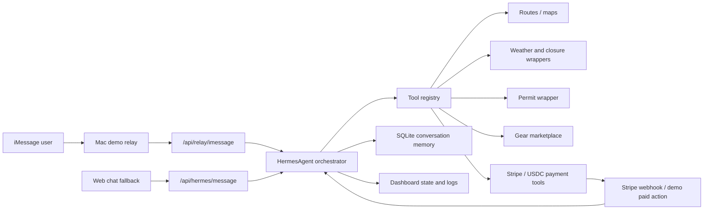

# Waypoint Hermes

Waypoint Hermes is an iMessage-first outdoor expedition agent for the Nous Hermes hackathon. The app is built around a Hermes agent runtime, not a plain chatbot: every message routes through the Hermes orchestrator, which decides what to ask, which tools to call, how to update expedition state, when to request payment approval, and when to generate the final expedition brief.

## Architecture



## What Is Included

- Next.js dashboard with Tailwind and a web chat simulator fallback.
- TypeScript Hermes runtime with `HermesAgent`, `MockHermesAgent`, and `RealHermesAgent` placeholder adapter.
- SQLite-backed conversation memory, expedition state, and tool call log.
- Expedition tools for route search, map links, weather, fire/closure risk, permits, packing, missing gear, rentals, budget, Stripe Checkout, USDC copy, mock vendor payout, emergency plan, and final brief.
- Stripe test-mode checkout creation when `STRIPE_SECRET_KEY` is configured, with a demo checkout URL fallback.
- Demo-only Mac iMessage relay scaffold.
- Joshua Tree demo data for Boy Scout Trail, California Riding and Hiking Trail, and Pine City / Desert Queen fallback.

## Setup

```bash
npm install
cp .env.example .env.local
npm run dev
```

Open [http://localhost:3000](http://localhost:3000).

## Environment

`.env.example` includes:

```bash
HERMES_API_KEY=
HERMES_BASE_URL=
STRIPE_SECRET_KEY=
STRIPE_WEBHOOK_SECRET=
NEXT_PUBLIC_STRIPE_PUBLISHABLE_KEY=
WEATHER_API_KEY=
MAPBOX_TOKEN=
DATABASE_URL=file:./.data/waypoint-hermes.sqlite
IMESSAGE_ALLOWED_SENDER=
NEXT_PUBLIC_APP_URL=http://localhost:3000
```

For Stripe test mode, set `STRIPE_SECRET_KEY` to a test secret key. If it is missing, Hermes still creates a demo checkout link so the flow can be shown locally. The app never creates checkout until the user explicitly replies `yes` or `approve`.

For a real Hermes API, set `HERMES_BASE_URL` and `HERMES_API_KEY`. The `RealHermesAgent` uses the same `HermesContext` and expects a `HermesResponse`, so the mock and real Hermes runtimes can be swapped without changing the dashboard or webhooks.

## Demo Script

Use the quick-reply buttons in the dashboard:

1. `Plan me a weekend backpacking trip in Joshua Tree.`
2. `Upcoming weekend, group of 2, intermediate, budget $250. We own a tent, backpack, sleeping bag, and stove. We will drive.`
3. `Option 1, Boy Scout Trail.`
4. `approve`
5. Click `Mark demo paid`, or text `payment complete`.

Hermes will ask intake questions, propose routes, check conditions and permits, identify missing gear, create a budget, request approval before payment, create checkout, mock a vendor payout to `Joshua Tree Gear Rental Partner`, and generate the final expedition brief.

## iMessage Relay

The relay lives in [scripts/imessage-relay/relay.ts](./scripts/imessage-relay/relay.ts) and is demo-only. It must run on macOS with Messages configured, Full Disk Access granted, and an allowlisted sender.

```bash
npm run dev
IMESSAGE_ALLOWED_SENDER="+15555550123" npm run imessage:relay
```

If the relay fails, use the dashboard simulator. It calls the same Hermes endpoint.

## Safety Guardrails

Waypoint Hermes is deliberately conservative:

- Does not suggest illegal camping.
- Does not guarantee safety.
- Warns that Joshua Tree has limited/no reliable water.
- Advises checking official park alerts and verifying current conditions before departure.
- Uses conservative heat/weather risk.
- Includes an emergency plan.
- Avoids advanced off-trail scrambling for beginners.

## Limitations

- Weather, fire/closure, permit availability, marketplace, and vendor payout are mocked wrappers.
- The iMessage relay is a local macOS hackathon demo utility, not production messaging infrastructure.
- The Stripe webhook marks the web demo conversation paid; production should map Stripe sessions to conversation IDs.
- Official park alerts, permits, route rules, and current conditions must be verified before departure.
